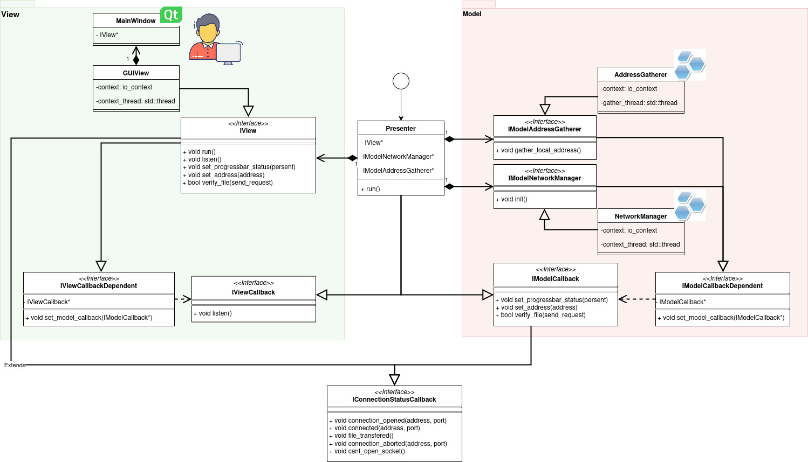

# Resume
P2PTransfer is an application to share files with LAN. It allows to use the full power of your router and Ethernet cable.
# Achievements
* 📊 **MVP** Architecture using **Qt Framework**. Application allows *Desktop* and *CLI interfaces*.
* 🪟 **Crossplatform build**: Application has versions for *Linux* and *Windows* built using cmake toolchain.
* 🛜 Internet Communication in LAN using **Boost.Asio** library.
* 🧪 Unit and Integration tests using **Google Test (Mock)** framework and CTest.
* 🤓 Documentation written with **Doxygen**.

# I want to run it!
If you want to use my application, you have two ways to do so:
1. **(easier):** Go to Releases #TODO and download the latest version for your OS.
2. **(for 🤓s):** Proceed with the guide below to build the application yourself.

## Build Yourself
**TL;DR**:
```bash
sudo apt install make g++ gcc qt6-base-dev -y
sudo apt install qt6-base-dev -y # For graphics
sudo apt-get install libboost-all-dev -y
sudo snap install cmake --classic
```
### Dependencies
To build the application, you will need some required dependencies: `cmake` (at least **4.0.1** version), `make`, `g++`, `gcc`. They can easily be installed with your local packet manager. For example:
```bash
sudo apt install make g++ gcc -y
sudo snap install cmake --classic
```
> At this moment CMake is on **3.28** version in `apt`, so you can just use `snap` for it.

Then you will need **Boost** library. You can build it yourself following their [guide](https://www.boost.org/doc/libs/1_88_0/more/getting_started/unix-variants.html) or simply just installing apt packet:
```bash
sudo apt-get install libboost-all-dev -y
```
Also, if you want to build Desktop version with **Qt**, you need the Qt😮. There are also a couple of ways to install it:
1. (**Beginner-friendly**) Download **Qt Creator** IDE, which includes all of the required Qt libraries (and many more) and a special IDE for it. If you have country issues to download and login, proceed with this [guide](https://vc.ru/dev/1125830-kak-ustanovit-qt-qt5-qt6-v-rossii-cherez-onlain-installyator-pri-blokirovke-ip-adresov).
2. (**Even More Easy**) Download the package from apt:
```bash
sudo apt install qt6-base-dev -y
```
3. (**for 🤓s**) Build qt from source:
```bash
git clone --recurse-submodules --shallow-submodules --depth 1 https://github.com/qt/qtbase
mkdir qtbase/build
cd qtbase/build
../configure
```
> You can change the github repo to any from github.com/qt if you want to install anything else. `qtbase` is enough for P2PTransfer.

After launching these commands, make sure that `configure` script finished successfully and there are no issues. It is ok if configurator freezed, just wait a bit.
When configuration is done, just build it with cmake as usual:
```bash
cmake --build . -j$(nproc)
sudo cmake --install . --prefix /usr/local
```
### Building Application
Now when we are done with all dependencies
```bash
git clone --depth 1 https://github.com/LeeDoor/p2ptransfer
```
Let's dive into CLI parameters:
1. `run_server.sh` or `p2ptransfer.exe`:
    * **`<PORT>`** - the port, where you are listening to connections.
2. `run_client.sh` or `p2ptransfer.exe`:
    * **`<ADDRESS>`** - IPv4 address of receiving machine. Get it using `ifconfig` or `ipconfig` commands.
    * **`<PORT>`** - Port of receiving machine you entered in previous script.
    * **`<FILENAME>`** - the path to file you want to send.

After sending, on your listening machine there will be the file called `READED_<FILENAME>`.
# Introduction
**P2PTransfer** is an application to transfer any files using P2P connection. You can connect one PC to another and send any files directly. If you use local Wi-Fi or even the Ethernet cable, you can speed up file transfer many times.
# The Server (file acceptor)
The server is the part of the project, which takes responsibility about receiving file. To reach an agreement about file transferation the server and the client would use the [language](#The language).
# The language
When a client looks for opened servers, it connects to everyone in a row and sends the **send request**:
```
REQUEST 
FILE bigfile.txt
SIZE 25000
```
* REQUEST means *I want to connect to you*.
* FILE means *I want to send you a file <filename>*.
* SIZE means *The file i want to send to you has a size <bytes> bytes*.

When a server gets a send request it sends a **send permission**. It consists of the `PERMISSION` word and sending filename:
```
PERMISSION 
FILE bigfile.txt
```
After the server sent a permission, it starts listening for a file. It gathers *<bytes>* amount of data and then replies with the **report**:
1. If transfer was successful, then the report is:
```
TRANSFERED 
FILE bigfile.txt
```
2. If transfer failed, the report is:
```
FAILED 
FILE bigfile.txt
```
