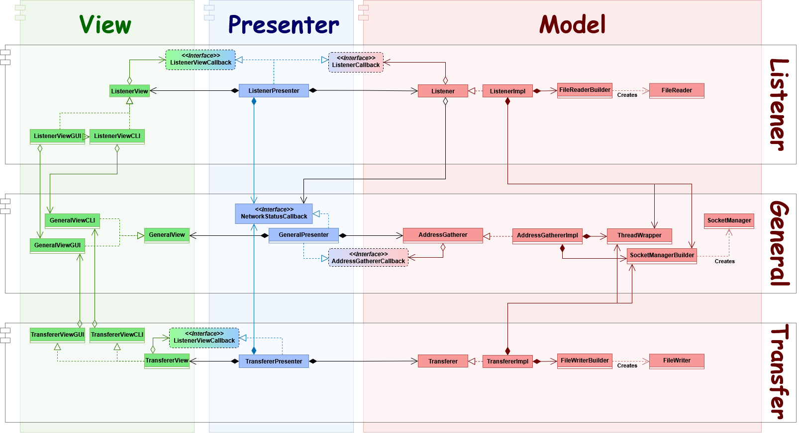
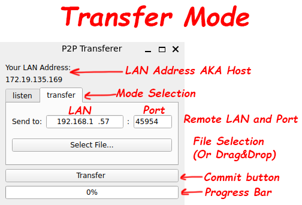

# Resume
P2PTransfer is an application to share files with LAN. It allows to use the full power of your router and Ethernet cable.
# Achievements
* 📊 **MVP** Architecture using **Qt Framework**. Application allows *Desktop* and *CLI interfaces*.
* 🪟 **Crossplatform build**: Application has versions for *Linux* and *Windows* built using cmake toolchain.
* 🌐 Internet Communication in LAN using **Boost.Asio** library.
* 🧪 Unit and Integration tests using **Google Test (Mock)** framework and CTest.
* 🤓 Documentation written with **Doxygen**.
  
# How To use
Application has two modes: 
1. **Listener**. In this mode application will listen for incoming connections in LAN.
2. **Transferer**. In this mode application will try to connect to some remote endpoint, who is *already listening* for connections.

## GUI Mode
In GUI Mode, you will face a window with some buttons. Take a look at the scheme:



## CLI Mode
All required instructions are provided with the `--help` flag. Here is an abstract from it:


1. `p2ptransfer <-h|--host address> <-p|--port port> <-f|--filename filename>`
Sends given <filename> to the remote user using <address>:<port> endpoint.
2. `p2ptransfer --get <-p|--port port>`
Starts to receive any incoming files at <port>. Should start listening before trying to send.

Flags:
  * `--help`                produce help message
  * `-h [ --host ] arg`     Address to connect to. Combined with -p <port>
  * `-p [ --port ] arg`     Port to connect to OR port to listen at
  * `-f [ --filename ] arg` Directory to a file being sent to remote user
  * `--get`                 Indicates the file receiving action

If you are **listening**, you have to provide `--get` flag with the `--port` value of listening port. To get the file from other user, tell him your LAN Address presented in the Terminal and Port you have passed to it.
If you are **transfering**, provide `--host`, `--port` and `--filename` arguments to connect to `<host>:<port>` endpoint and send it the `filename`.

---
Useful Tips:
* To select the mode, switch tabs **listen** and **transfer**.
* You can select the file to send using the explorer by pressing **Select file...** button.
* Also you can select the file by dropping it on the window.
* When you are ready, press the big button at the bottom. If something goes wrong, You will get an error Popup.
* If Application argues on a Port, try to insert some random value in range [8000; 65000]. 

# Try yourself
If you want to run the application, you have two ways to do so:
1. **(easier):** Go to [Latest Release](https://github.com/LeeDoor/p2ptransfer/releases/) and download the latest version for your OS.
2. **(harder):** Proceed with the guide below to build the application yourself.

## Build Yourself
### Dependencies
#### **TL;DR**:
```bash
sudo apt install make g++ gcc qt6-base-dev -y
sudo apt install qt6-base-dev -y # For graphics
sudo apt-get install libboost-all-dev -y
sudo snap install cmake --classic
```

#### Step-by-step guide
To build the application, you will need some required dependencies: `cmake` (at least **4.0.1** version), `make`, `g++`, `gcc`. They can easily be installed with your local packet manager. For example:
```bash
sudo apt install make g++ gcc -y
sudo snap install cmake --classic
```
> At this moment CMake is on **3.28** version in `apt`, so you can just use `snap` for it.

Then you will need **Boost** library. You can build it yourself following their [guide](https://www.boost.org/doc/libs/1_88_0/more/getting_started/unix-variants.html) or simply just installing the apt packet:
```bash
sudo apt-get install libboost-all-dev -y
```
Also, if you want to build Desktop version with **Qt**, you need the Qt😮. There are also a couple of ways to install it:
1. (**easier**) Download **Qt Creator** IDE, which includes all of the required Qt libraries (and many more) and a special IDE for it. If you have country issues to download and login, proceed with this [guide](https://vc.ru/dev/1125830-kak-ustanovit-qt-qt5-qt6-v-rossii-cherez-onlain-installyator-pri-blokirovke-ip-adresov).
2. (**super-easy**) Download the package from apt:
```bash
sudo apt install qt6-base-dev -y
```
3. (**harder**) Build qt from source:
```bash
git clone --recurse-submodules --shallow-submodules --depth 1 https://github.com/qt/qtbase
mkdir qtbase/build
cd qtbase/build
../configure
```
> You can change the github repo to any from https://github.com/qt if you want to install anything else. `qtbase` is enough for P2PTransfer.

After launching these commands, make sure that `configure` script finished successfully and there are no issues. It is ok if configurator freezed, just wait a bit.
When configuration is done, just build it with cmake as usual:
```bash
cmake --build . -j$(nproc)
sudo cmake --install . --prefix /usr/local
```
### Building Application
Now when we are done with all dependencies:
```bash
git clone --depth 1 https://github.com/LeeDoor/p2ptransfer
cd p2ptransfer/scripts
./build.sh
```
You can avoid using `build.sh` script. It was created to simplify different build directories and configure the build.

If you want to build both the CLI and Qt version, run `./build.sh` without any args.

If you want to build with CLI only (doesn't require Qt to build), use `./build.sh 0`.

If you want to build with Qt only, use `./build.sh 1`.

### Running Application
After Proceeding previous steps to build the application manually, there are some scripts to run the resulting executable:
```bash
./run_cli.sh # Runs application in CLI mode.
./run_graphics.sh # Runs application in Graphics mode.
```
